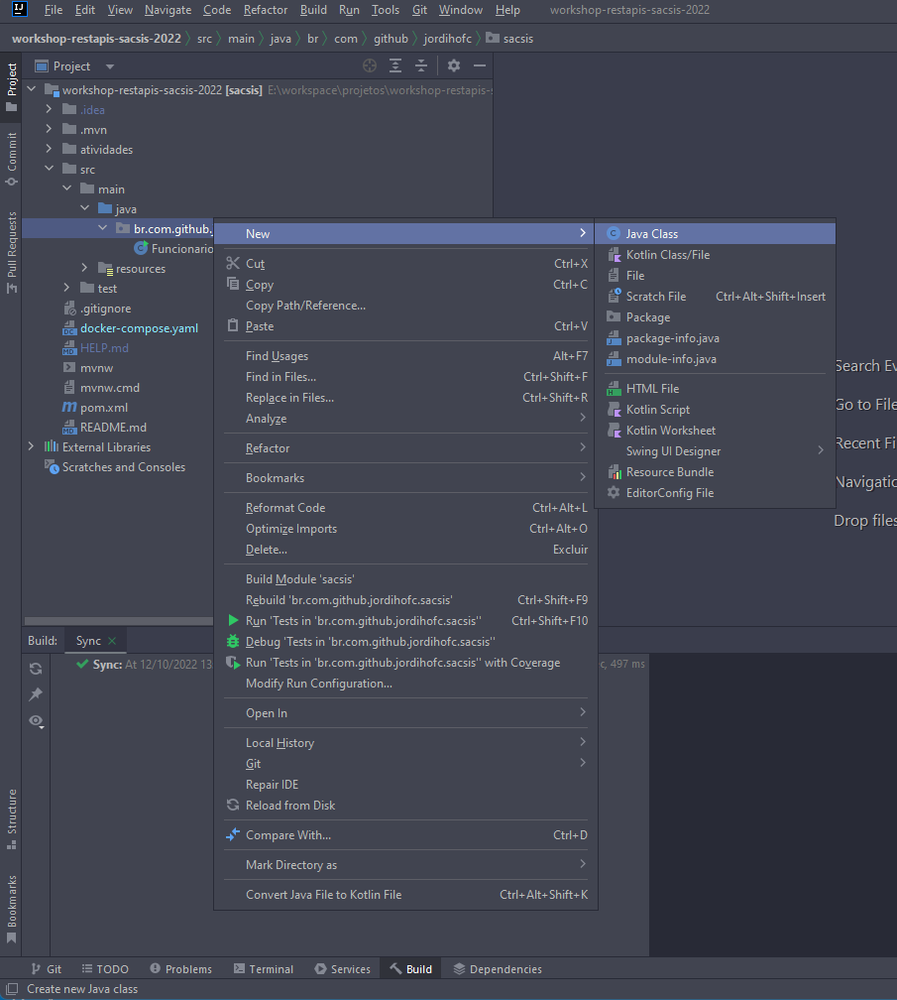
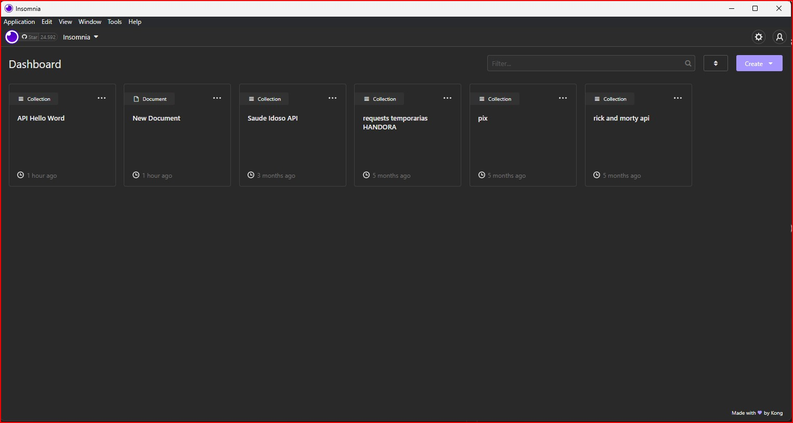
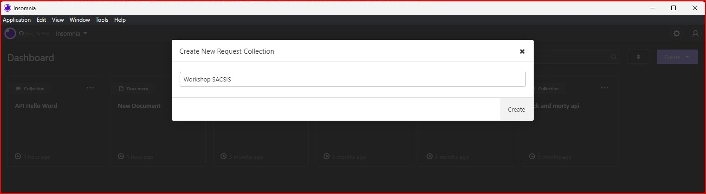
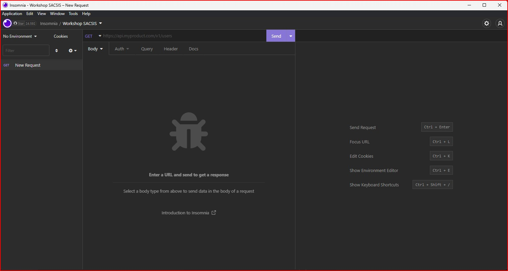
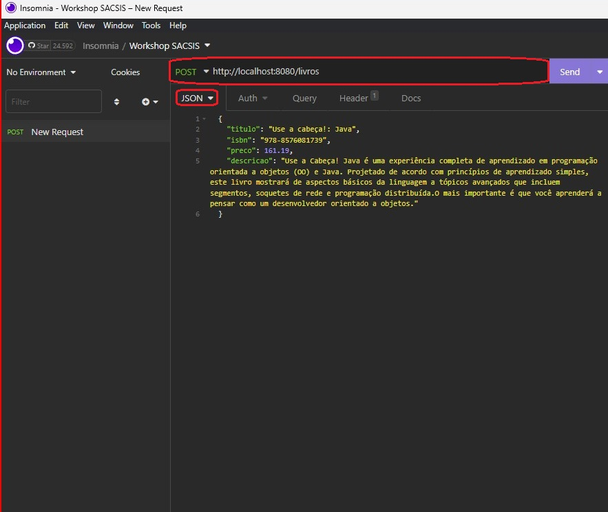
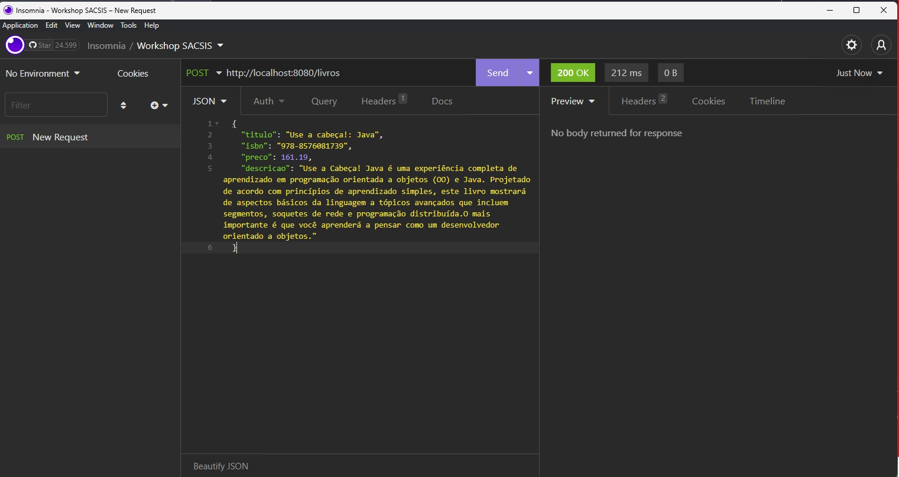
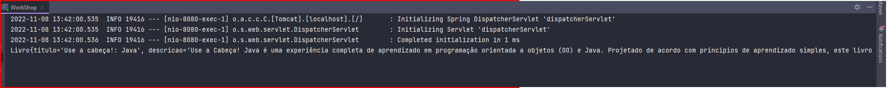

# Criando a API REST para Cadastro de Livros

Nesta atividade iremos criar uma API para cadastrar livros, para este contexto apenas o titulo, descricao, isbn e preco são necessários.

## Criando a API REST

1. Crie uma classe nome `CadastraLivroController`.
    1. Clique com botão direito sobre o pacote principal do projeto.
    2. Selecione a opção **new**
    3. Selecione a opção Java Class

    

2. Habilite a classe para receber requisições da Web tornando ela uma API REST através da anotação `@RestController` sobre assinatura da classe. 


    ```JAVA
    import org.springframework.web.bind.annotation.RestController;

    @RestController
    public class CadastraLivroController {
    }
    ```
3. Crie o metodo cadastrar na classe e anote-o com  `@PostMapping("/livros")` para determinar que ira atender as requisições para rota /livros que utilizem o verbo HTTP POST.

    
    ```JAVA
    import org.springframework.web.bind.annotation.PostMapping;
    import org.springframework.web.bind.annotation.RequestBody;
    import org.springframework.web.bind.annotation.RestController;

    @RestController
    public class CadastraLivroController {

        @PostMapping("/livros")
        public void  cadastrar() {
           
        }
    }
    ```
### Recebendo as informações do Livro que vai ser cadastradro

As informações que iremos receber através da requisição precisam ser organizadas e agrupadas em uma classe em nosso sistema. Para fazer isto iremos primeiramente criar a classe `Livro`. Para cria-la siga os passos abaixo.

1. Clique com botão direito sobre o pacote principal do projeto.
2. Selecione a opção **new**
3. Selecione a opção Java Class

    
4. É esperado que contenham o seguinte resultado
    ```JAVA
    public class Livro {
    }
    ```

Após a criação da classe é necessário definir os atributos. E para isso use os seguintes tipos:

- Titulo: String
- Descricao: String
- Isbn: String
- Preco: BigDecimal (Utilizado para contas matematicas que exigem precisão)  

Por convenção o nome de um atributo em Java deve ser escrito no padrão camelCase, que define que a primeira letra da palavra inicial deve ser **Minuscula**, e para as proximas palavras deve ser **Maiuscula**. Exemplo: idade do carro -> idadeDoCarro.

E também utilizaremos o modificador de acesso private antes do tipo de cada atributo. 

Por fim, sua classe deverá ficar da seguinte forma:

```JAVA
public class Livro {
    private String titulo;
    private String descricao;
    private String isbn;
    private BigDecimal preco;
}
```

E para que seja possivel definir valores para cada atributo, e ler estes valores iremos gerar os Getters e Setters. Para gerar os mesmos clique sobre qualquer linha da classe e utlizem o atalho.

```
ALT + INSERT
```

E selecionem a opção: Getters and Setters. O esperado é que a classe esteja da seguinte forma.

```JAVA
import java.math.BigDecimal;

public class Livro {
    private String titulo;
    private String descricao;
    private String isbn;
    private BigDecimal preco;

    public String getTitulo() {
        return titulo;
    }

    public void setTitulo(String titulo) {
        this.titulo = titulo;
    }

    public String getDescricao() {
        return descricao;
    }

    public void setDescricao(String descricao) {
        this.descricao = descricao;
    }

    public String getIsbn() {
        return isbn;
    }

    public void setIsbn(String isbn) {
        this.isbn = isbn;
    }

    public BigDecimal getPreco() {
        return preco;
    }

    public void setPreco(BigDecimal preco) {
        this.preco = preco;
    }
}

```
### Recebendo a classe livro no metodo Cadastrar da nossa API

Agora que já temos uma classe que ira receber e armazenar na memoria as informações do Livro que será cadastrado, iremos adaptar nossa API para recebe-la. Para adaptar iremos para classe `CadastraLivroController` e seguiremos os seguintes passos.

1. Adicionaremos um parametro do tipo Livro com nome de request ao metodo cadastrar.

    
    ```JAVA
    import org.springframework.web.bind.annotation.PostMapping;
    import org.springframework.web.bind.annotation.RestController;

    @RestController
    public class CadastraLivroController {
       
        @PostMapping("/livros")
        public void cadastrar(Livro request) {
            
        }

    }
    ```

2. Definiremos que as informações que serão armazenadas no objeto request do tipo Livro, estão no corpo (Body) da requisição. Para isto iremos adicionar a anotação `@RequestBody` no parametro request.
    1. Para que temos certeza que recebemos as informações, insira um `System.out.println()` no objeto request no corpo do metodo.

    ```JAVA
    import org.springframework.web.bind.annotation.PostMapping;
    import org.springframework.web.bind.annotation.RequestBody;
    import org.springframework.web.bind.annotation.RestController;

    @RestController
    public class CadastraLivroController {
       
        @PostMapping("/livros")
        public void cadastrar(@RequestBody Livro request) {

            System.out.println(request);
        }

    }

### Testando nossa API através do Insomnia

1.  Abra o Insomnia

    

2. Clique no botão a direita **Create** e seleciona a opção **Request Colletion**. E crie a Collection Workshop SACSIS.

    

3. Crie uma Request HTTP, vá até o icone a esquerda com o simbolo: (+), e selecione HTTP REQUEST.
    

4. Ajuste a requisição.
    1. Insira o seguinte endereço na barra: `http://localhost:8080/livros`
    2. Altere o verbo de GET para POST no icone que antecede a barra de endereços
    3. Use o botão Body para alterar o tipo para  JSON
    4. Utilize o Seguinte JSON para enviar a requisição
        ```JSON
        {
            "titulo": "Use a cabeça!: Java",
            "isbn": "978-8576081739",
            "preco": 161.19,
            "descricao": "Use a Cabeça! Java é uma experiência completa de aprendizado em programação orientada a objetos (OO) e Java. Projetado de acordo com princípios de aprendizado simples, este livro mostrará de aspectos básicos da linguagem a tópicos avançados que incluem segmentos, soquetes de rede e programação distribuída.O mais importante é que você aprenderá a pensar como um desenvolvedor orientado a objetos."
        }
        ```
    
    Quando sua tela estiver igual a abaixo, clique no botão **send**

    

5. Observando o resultado

    Obeserve que é demostrado uma caixa verde com o texto 200 OK, este indicador representa que a requisição foi atendida com sucesso.

    

    Se olharmos no console do IntelliJ é possível observar que as informações foram printadas na tela.

    

    