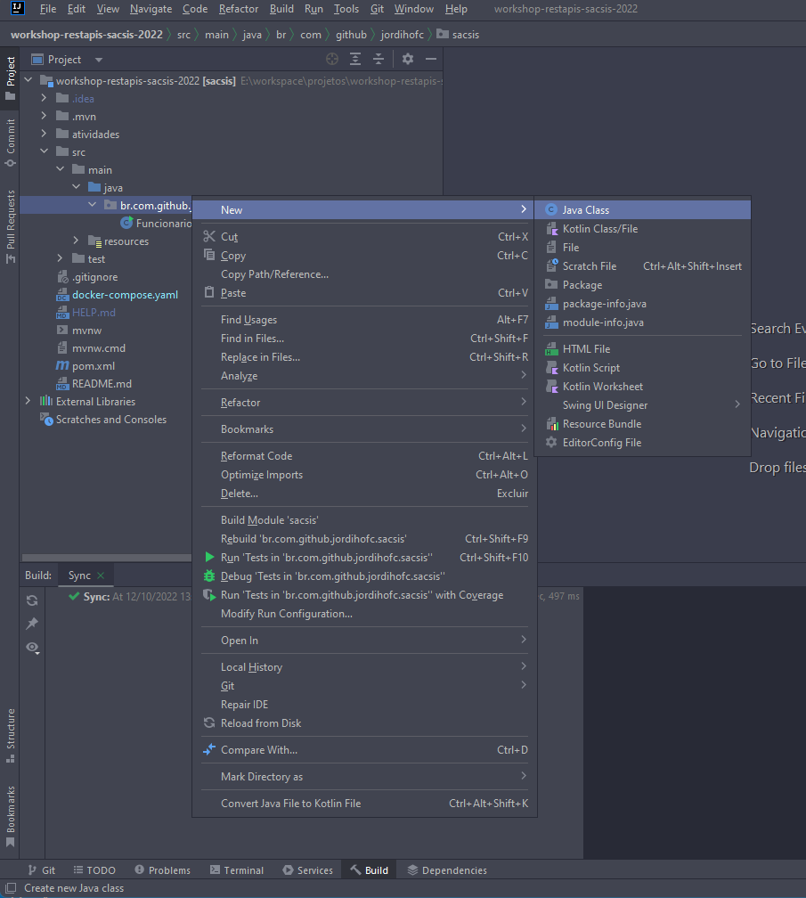

1. Crie uma classe nome `HelloWordController`.
    1. Clique com botão direito sobre o pacote principal do projeto.
    2. Selecione a opção **new**
    3. Selecione a opção Java Class

    

2. Habilite a classe para receber requisições da Web tornando ela uma API REST através da anotação `@RestController` sobre assinatura da classe. 

    ```JAVA
    import org.springframework.web.bind.annotation.RestController;

    @RestController
    public class HelloWordController {
    }
    ```
3. Crie o metodo helloWord na classe e anote-o com  `@GetMapping("/hello-word")` para determinar que ira atender as requisições para rota /hello-word que utilizem o verbo GTTP GET.

    ```JAVA
    import org.springframework.http.ResponseEntity;
    import org.springframework.web.bind.annotation.GetMapping;
    import org.springframework.web.bind.annotation.RestController;

    @RestController
    public class HelloWordController {

        @GetMapping("/hello-word")
        public String helloWord(){
            return "Hello Word";
        }

    }
    ```
4. Execute o projeto, indo até a classe `WorkshopApplication` e execute o metodo **main** ao clicar na seta verde.

    

5. Testando a API
    1. Abra o seu navegador e acesse o seguinte endereço: `http://localhost:8080/hello-word`

    Ao acessar ira encontrar uma pagina parecida com a imagem abaixo, indicando que nossa API  já esta atendendo requisições.

    