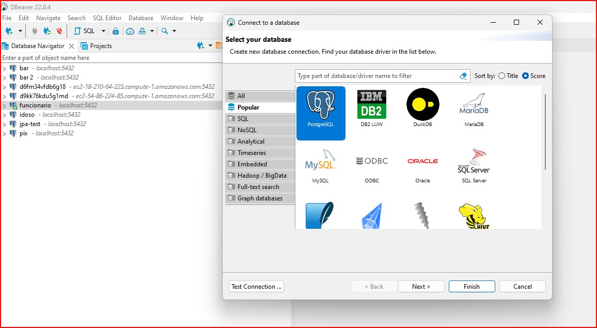
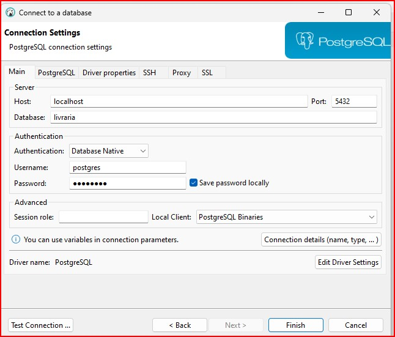

1. Abra o Dbeaver
2. Vá no menu superior e clique no icone de uma tomada com +

    
3. Selecione o PostgreSQL
4. Ao abrir a proxima tela, troque o campo database por: livraria
5. Para senha utilize postgres
    
6. Clique em finish e esta feita a conexão