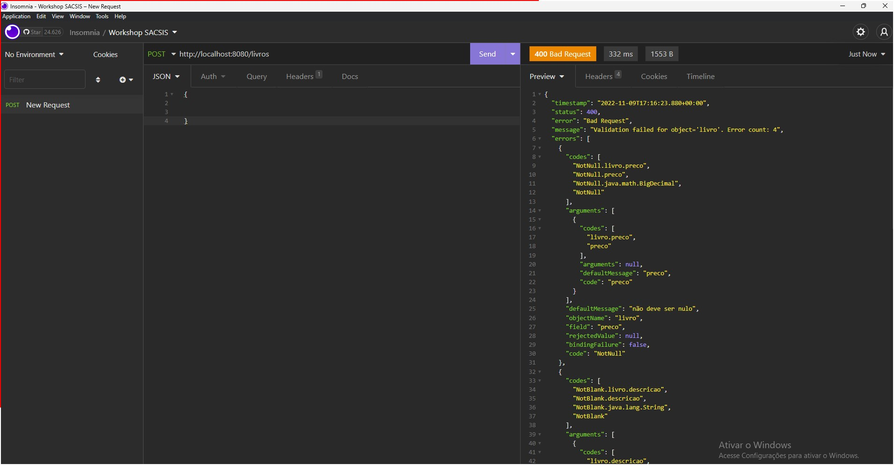

A verdade é após adicionarmos a validação começamos ganhar na consistência dos nossos dados, porém, visualizamos que o codigo cresceu muito, e ficou um pouco complicado de ler. E isso indica necessidade de aplicar melhorias em seu designe.

Isto me faz pensar que seria muito legal se eu pudesse dizer qual é a minha intenção de validação e que outro componente realizasse por mim.

E o mais legal disso é que nosso projeto possui suporte a Bean Validation, que permite que utilizar anotações java para executar validações de maneira declarativa.

### Habilitando as validações da Bean Validation

1. Abra a classe `Livro`
2. Va no atrituto titulo e na linha acima anote com `@NotBlank`.

    ```JAVA
    @Entity
    public class Livro {
        @Id
        @GeneratedValue
        private Long id;
        @NotBlank
        private String titulo;
        // demais informações omitidas
    }
    ```
    Esta anotação verifica se uma String é nula ou vazia, e caso seja é lançado uma exceção.

3. Repita o processo para Descrição e Isbn

    ```JAVA
    @Entity
    public class Livro {
        @Id
        @GeneratedValue
        private Long id;
        @NotBlank
        private String titulo;
        @NotBlank
        private String descricao;
        @NotBlank
        private String isbn;
        // demais informações omitidas
    }
    ```
4. Adicione sobre o atributo preco `@NotNull`, afim de validar se o valor é diferente de nulo.
    
    ```JAVA
    @Entity
    public class Livro {
        @Id
        @GeneratedValue
        private Long id;
        @NotBlank
        private String titulo;
        @NotBlank
        private String descricao;
        @NotBlank
        private String isbn;
        @NotNull
        private BigDecimal preco;
        // demais informações omitidas
    }
    ```
5. Sobre o atributo titulo adicione anotação `@Size(max = 35)`, afim de validar se o tamanho maximo da string é 35 caracteres
    
    ```JAVA
    @Entity
    public class Livro {
        @Id
        @GeneratedValue
        private Long id;
        @NotBlank
        @Size(max = 35)
        private String titulo;
        @NotBlank
        private String descricao;
        @NotBlank
        private String isbn;
        @NotNull
        private BigDecimal preco;
        // demais informações omitidas
    }
    ```
6. Sobre o atributo descricao adicione anotação `@Size(min = 90)`, afim de validar se o tamanho minimo da string é 90 caracteres

    ```JAVA
    @Entity
    public class Livro {
        @Id
        @GeneratedValue
        private Long id;
        @NotBlank
        @Size(max = 35)
        private String titulo;
        @NotBlank
        @Size(min = 90)
        private String descricao;
        @NotBlank
        private String isbn;
        @NotNull
        private BigDecimal preco;
        // demais informações omitidas
    }

7. Sobre o atributo preco adicione a anotação `@Positive`, afim de validar se o valor é maior que zero.

    ```JAVA
    @Entity
    public class Livro {
        @Id
        @GeneratedValue
        private Long id;
        @NotBlank
        @Size(max = 35)
        private String titulo;
        @NotBlank
        @Size(min = 90)
        private String descricao;
        @NotBlank
        private String isbn;
        @NotNull
        @Positive
        private BigDecimal preco;
        // demais informações omitidas
    }

## Habilitando as validações de maneira automatica

A verdade é que já declaramos o que desejamos que seja verificado através das anotações, porém, é necessário indicar em qual momento do fluxo de negocio elas precisam ser executadas.

O Spring dispara as validações de maneira automatica quando ele encontrar a anotação `@Valid`.

Nossa intenção é que quando as informações forem recebidas na API sejam validadas, então devemos adicionar a anotação junto ao parametro request do metodo cadastrar no `CadastraLivroController`, após a anotação `@RequestBody`.

```JAVA
    @PostMapping("/livros")
    public void cadastrar(@RequestBody @Valid Livro request) {
        //demais informações omitidas
    }
```

E o melhor é que dado que as validações falhem, o Spring automaticamente irá acumular as mensagens e compor junto a resposta com Status 400 BAD REQUEST. O que justifca a retirada de todos os ifs. 

Ao fim nosso controller deve ficar correspondente ao codigo abaixo.

```JAVA
import org.springframework.web.bind.annotation.PostMapping;
import org.springframework.web.bind.annotation.RequestBody;
import org.springframework.web.bind.annotation.RestController;

@RestController
public class CadastraLivroController {
    private final LivroRepository repository;

    public CadastraLivroController(LivroRepository repository) {
        this.repository = repository;
    }

    @PostMapping("/livros")
    public void cadastrar(@RequestBody Livro request) {
        
        System.out.println(request);
        repository.save(request);

    }
}
```

## Testando nossa API no Insomnia

1. Vamos realizar um teste com dados invalidos, informando null para todos atributos

    

    Perceba que agora nossa resposta é bem maior, e contem detalhes sobre os erros.

2. Realize o teste de sucesso para confirmar se tudo esta funcionando como deveria.

