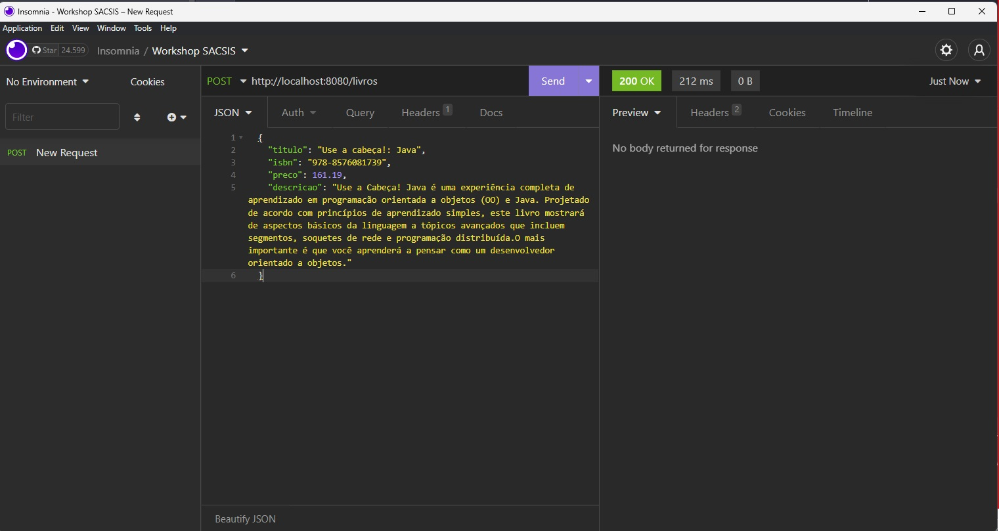
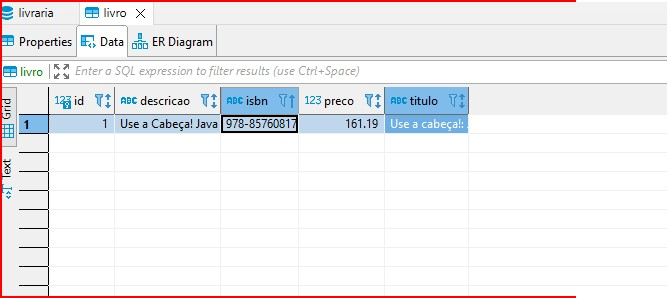

## Mapeando a classe Livro como Entidade
Nosso proximo passo é fazer com que os dados recebidos em nossa API REST sejam salvos no banco de dados, e para isto precisaremos utilizar o Spring Data e a JPA/Hibernate. Estas tecnologias facilitaram o uso do BD em nossa aplicação escrevendo codigo SQL para gente.

Para que a gente se beneficie do uso dessas técnologias é necessário mapear em nosso projeto qual classe se refere a uma tabela no BD. Então iremos realizar o mapeando com os seguintes passos:

1. Na classe Livro anote sobre sua assinatura a mesma com `@Entity` para indicar que esta classe faz referência a uma tabela no BD.

    ```JAVA
    @Entity
    public class Livro {
        private String titulo;
        private String descricao;
        private String isbn;
        private BigDecimal preco;
    }
    ```
2. Determinando a PK da entidade Livro
   Para que a JPA/Hibernate entenda que uma classe é uma entidade, é necessário que a mesma possua um ID. E que este ID esteja maepado através da anotação `@Id`.
   Então o primeiro passo será criar um atributo do tipo inteiro para representar este ID. Visando que podemos cadastrar muitos Livros no sistema, utilizaremos o tipo Long.

    ```JAVA
    @Entity
    public class Livro {
        @Id
        private Long id;
        private String titulo;
        private String descricao;
        private String isbn;
        private BigDecimal preco;
    }
    ```

    E para que não nos preocupamos em gerar valores unicos para este id, podemos delegar a geração para o BD, através da anotação `@GeneratedValue`.

    ```JAVA
    @Entity
    public class Livro {
        @Id
        @GeneratedValue
        private Long id;
        private String titulo;
        private String descricao;
        private String isbn;
        private BigDecimal preco;
    }
    ```

## Criando o Repositorio da Spring Data JPA

Para que os codigos SQL sejam gerados de maneira automatica é necessário que a classa contenham um Repositorio.
E para criar um repositorio para classe Livro, iremos fazer os seguintes passos:

1. Crie uma interface com nome `LivroRepository`
    
    1. Clique com botão direito sobre o pacote principal do projeto.
    2. Selecione a opção **new**
    3. Selecione a opção Java Class
    4. Selecione a opção Interface
    5. É esperado que contenham o seguinte resultado
    
    ```JAVA
    public interface LivroRepository {
    }
    ```

2. Utilize a herança para extender a interface JpaRepository.

    1. Após o nome LivroRepository utilize a palavra **`extends`**  e junte com JpaRepository<Livro,Long>

    2. É esperado que contenham o seguinte resultado

    ```JAVA
    public interface LivroRepository extends JpaRepository<Livro, Long> {
    }
    ```

## Utilizando o Repository no `CadastraLivroController`

Agora que temos o LivroRepository disponivel é possivel utiliza-lo em diversos pontos do sistema para realizar operações junto ao BD.

Para que nossa API salve as informações do livro, é necessário que o Controller conheça o Repository.

1. Crie um atributo com modificador **`private`**, e **final** para um atributo do tipo LivroRepository.

    ```JAVA
    @RestController
    public class CadastraLivroController {
        private final LivroRepository repository;
        // demais informações omitidas
    }
    ``` 

2. Crie um construtor que receba o LivroRepository.

    ```JAVA
    @RestController
    public class CadastraLivroController {
        private final LivroRepository repository;

        public CadastraLivroController(LivroRepository repository){
            this.repository=repository;
        }
        // demais informações omitidas
    }
    ``` 

3. Salvando o Livro com repository


    ```JAVA
    import org.springframework.web.bind.annotation.PostMapping;
    import org.springframework.web.bind.annotation.RequestBody;
    import org.springframework.web.bind.annotation.RestController;

    @RestController
    public class CadastraLivroController {
        private final LivroRepository repository;

        public CadastraLivroController(LivroRepository repository){
            this.repository=repository;
        }

        @PostMapping("/livros")
        public void cadastrar(@RequestBody Livro request) {

            System.out.println(request);
            repository.save(livro);
        }

    }
    ```
4. Testando nossa API com Insomnia

    1. Primeiro passo é reniciar nossa API, para fazer isto utilize o comando abaixo.

        ```
        SHIFT + F10
        ```
    2. Apos executar o comando, verifique o console da aplicação, e observer que o Hibernate gerou o script DDL para criação da tabela.

        
    
    3. Agora que nosso Servidor esta de pé iremos utilizar o Insomnia para executar nossa requisição. Então abra o mesmo, e aperte o botão **Send**.

        
    
        Repare que o resultado no insomnia é o mesmo que antes, porém, agora devemos observar no console qual resultado da nossa requisição.

    4. Observando os Logs do Console

        

        Olha-so, o Hibernate automaticamente gerou o SQL INSERT necessário para inclusão das informações no Banco de Dados.
    
    5. Verificando no Dbeaver se o registro foi salvo.
        
        Caso nunca tenha feito a [conexão pelo Dbeaver nasta seguir este tutorial](fazendo-conexao-com-bd-comdbeaver.md).


        

        E sim, nossa API ja é capaz de salvar as informações recebidas no Banco de Dados.