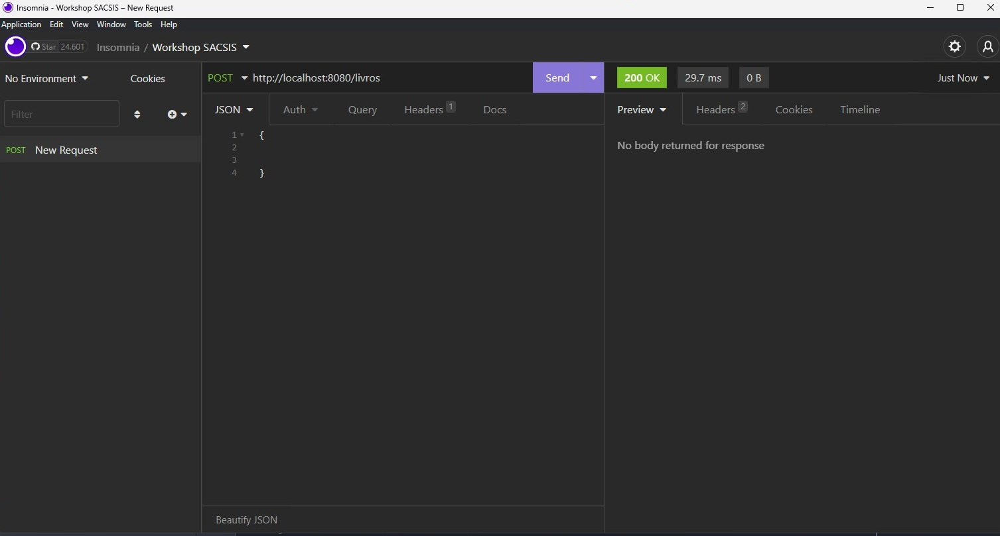
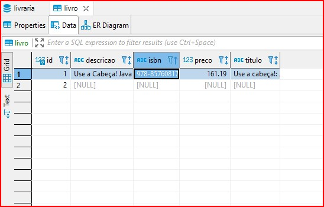
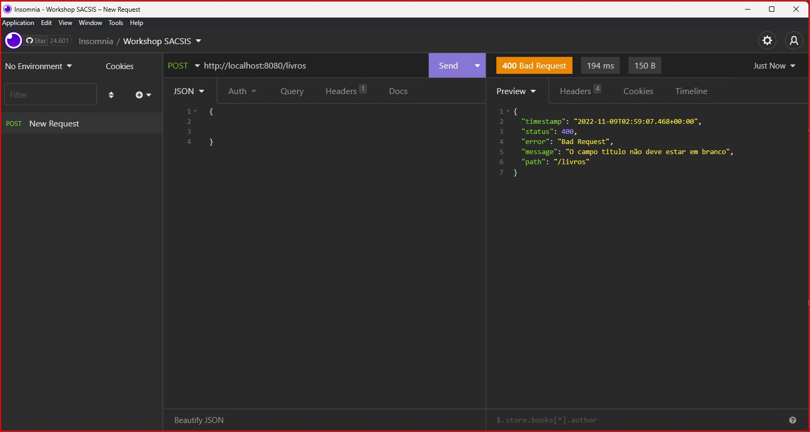
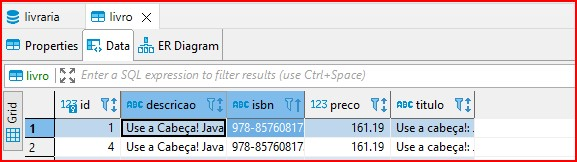

Já evoluimos bastante até aqui, no momento nossa API já recebe informações e tem a capacidade de salvar as mesmas no Postgres. Porém, nem tudo são flores, e se mandarmos requisições com dados em brancos será salvo o registro com id apenas. Veja Abaixo.



Nossa API responde que requisição foi atendida com sucesso, e se olharmos no Banco de dados encontramos o seguinte registro.



Para evitar que informações inconsistentes como estas sejam salvas, é necessário que antes de salvar os registros adicionemos validações (IFs), garantindo que se caso algum dado não atenda uma validação uma mensagem de erro é retornada ao cliente (Client).

### E ai vem a pergunta, quais são as validações que iremos aplicar para o cadastro de um livro?

Para que um livro seja salvo é necessário que:

- Titulo, Descrição, Isbn e preco são obrigatorios.
- Titulo deve ter no maximo 35 caracteres
- Descricao deve conter no minimo 90 caracteres
- o preco deve ser maior que zero

Então dado a isso, iremos adicionar estas regras dentro do nosso `CadastraLivroController`. Então agora para adicionar as regras siga os seguintes passos.

1. No metodo cadastrar do `CadastraLivroController`, adicione um If verificando se titulo não esta em branco. Caso esteja é necessário que defirmos uma mensagem de erro apropriada é que retornemos um HTTP Status Code assertivo na Response.

    De acordo com o protocolo HTTP os Status da familia 2xx representam que as solicitações foram aceitas com Sucesso. 

    E que os Status da familia 4xx representam que ocorreu um erro dado a entrada de dados incorreta pelo cliente da API. E para o caso de error na entrada de dados, o Status 400 BAD REQUEST deve ser utilizado.

    O Spring fornece diversas formas para definir o Status de Erro Apropriado, e um delas é Subir uma exceção do tipo `ResponseStatusException`. Desta forma o proprio adiciona ao Status Code e mensagem de erro informados na Exception na  Response HTTP.

    Então caso o titulo seja nulo ou esteja em branco, lance uma ResponseStatusException informando BadRequest como Status e a seguinte mensagem: "O campo titulo não deve estar em branco".

    ```JAVA
    @RestController
    public class CadastraLivroController {
        private final LivroRepository repository;

        public CadastraLivroController(LivroRepository repository) {
            this.repository = repository;
        }

        @PostMapping("/livros")
        public void cadastrar(@RequestBody Livro request) {
            String titulo = request.getTitulo();
            if (titulo == null || titulo.isBlank()) {
                throw new ResponseStatusException(HttpStatus.BAD_REQUEST, "O campo titulo não deve estar em branco");
            }

            repository.save(request);
        }
    }
    ```
2. Repita o processo para os campos Isbn e Descricao
3. Verifique se o tamanho do titulo é no maximo 35 caracteres
4. Verifique se o tamanho da descricao é no minimo 90 caracteres
5. Verifique se o campo preco não é nulo
6. Verifique se o campo preco é maior que zero 

Ao fim seu codigo deve estar igual ao codigo abaixo.

```JAVA
@RestController
public class CadastraLivroController {
    private final LivroRepository repository;

    public CadastraLivroController(LivroRepository repository) {
        this.repository = repository;
    }

     @PostMapping("/livros")
    public void cadastrar(@RequestBody Livro request) {
        String titulo = request.getTitulo();
        if (titulo == null || titulo.isBlank()) {
            throw new ResponseStatusException(HttpStatus.BAD_REQUEST, "O campo titulo não deve estar em branco");
        }

        if (titulo.length() <= 35) {
            throw new ResponseStatusException(HttpStatus.BAD_REQUEST, "O campo titulo não deve ser maior que 35 caracteres");
        }

        String descricao = request.getDescricao();
        if (descricao == null || descricao.isBlank()) {
            throw new ResponseStatusException(HttpStatus.BAD_REQUEST, "O campo descricao não deve estar em branco");
        }

        if (titulo.length() >= 90) {
            throw new ResponseStatusException(HttpStatus.BAD_REQUEST, "O campo descricao  deve ser maior que 90 caracteres");
        }

        String isbn = request.getIsbn();
        if (isbn == null || isbn.isBlank()) {
            throw new ResponseStatusException(HttpStatus.BAD_REQUEST, "O campo isbn não deve estar em branco");
        }

        if (request.getPreco() == null) {
            throw new ResponseStatusException(HttpStatus.BAD_REQUEST, "O campo preco não deve estar em branco");
        }

        if (request.getPreco().compareTo(BigDecimal.ZERO) <= 0) {
            throw new ResponseStatusException(HttpStatus.BAD_REQUEST, "O campo preco  deve ser maior que zero");
        }

        System.out.println(request);
        repository.save(request);

    }
}
```

## Testando nossa API no Insomnia

1. Testando com dados invalidos, para realizar este teste envie todos campos em branco

    

    Aqui é retornado apenas a mensagem da primeira validação já que o fluxo é interropido. 

2. Testando o envido de dados validos

    

    E para confirma, basta da uma olhada no Dbeaver na tabela de Livros

    